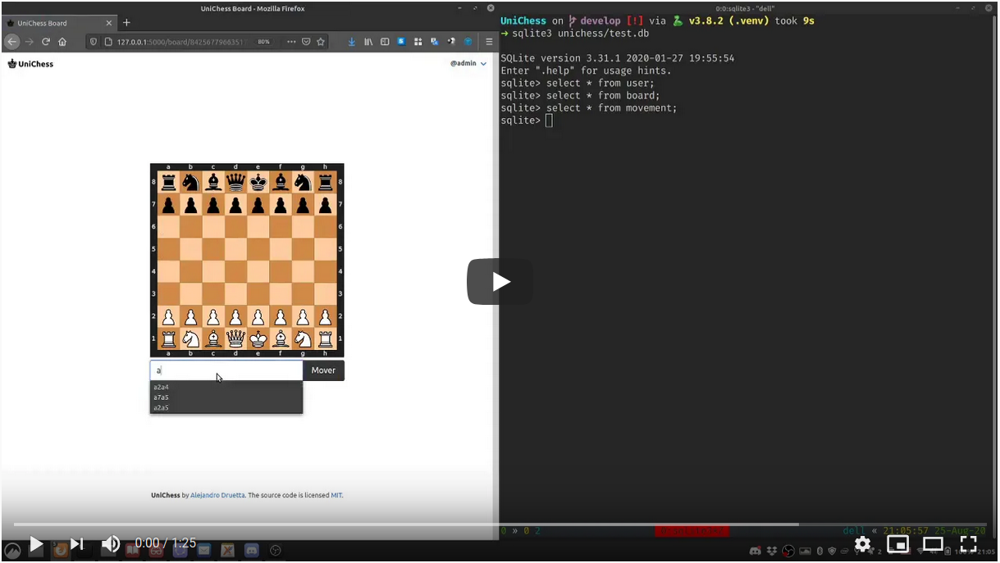

# UniChess

[](https://youtu.be/PvlhOd1It4U)

- Criar ambiente virtual

```bash
    python3 -m venv .venv
    source .venv/bin/activate
```

- SQLite3

```bash
    sudo apt install sqlite3
    sudo apt install shellcheck
```

- Instalar

```bash
    make install
```

- Executar

```bash
    make run
```

- Rodar linters

```bash
    make lint
```

- Rodar testes

```bash
    make test
```

- Limpar e reinicializar

```bash
    make clean
```

- Database

```bash
    make initdb
    make upgradedb
```

- Implementar logging

```python
    from flask import current_app

    # Com DEBUG_TB_ENABLED em ext/config
    current_app.logger.debug("message")
```

